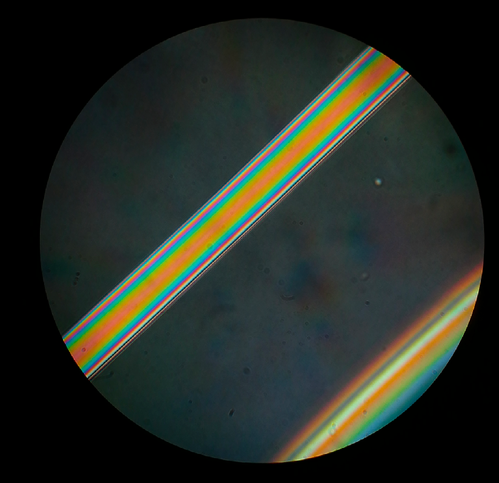
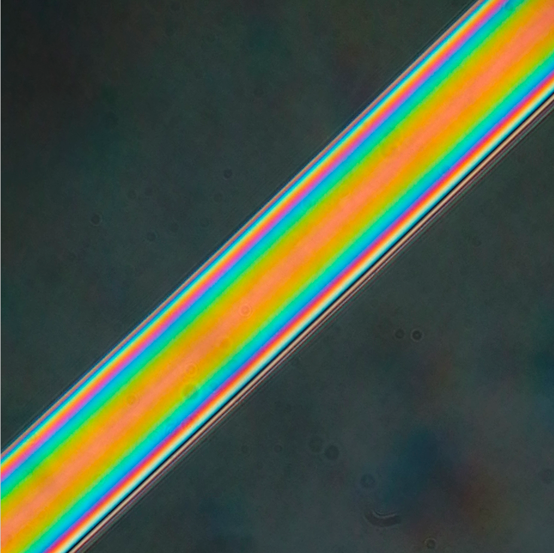
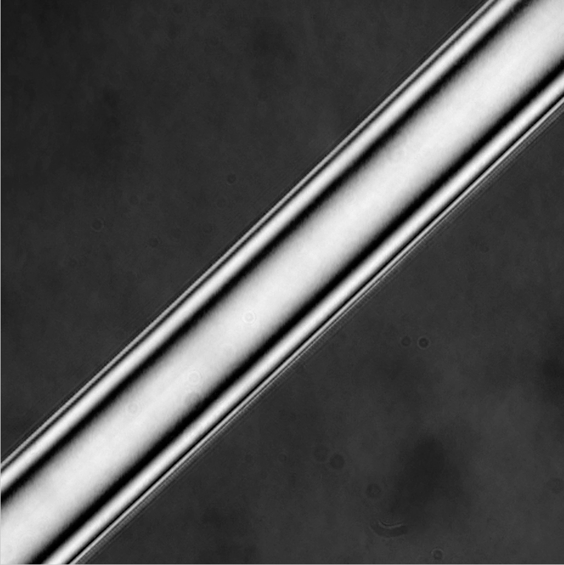
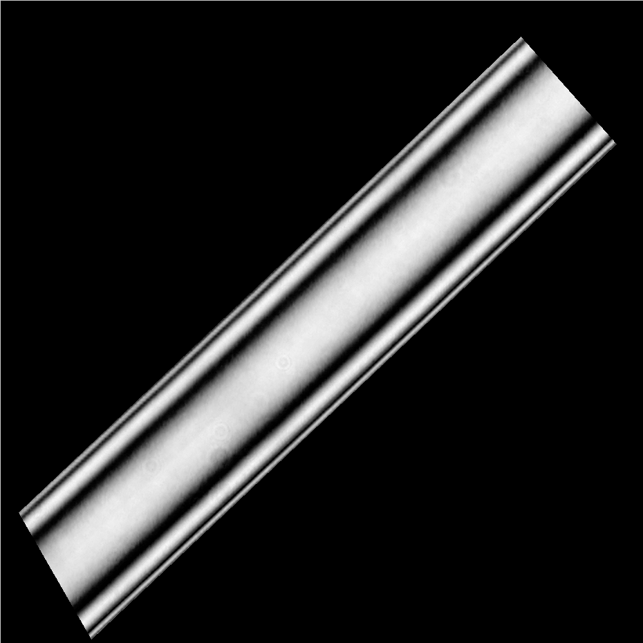
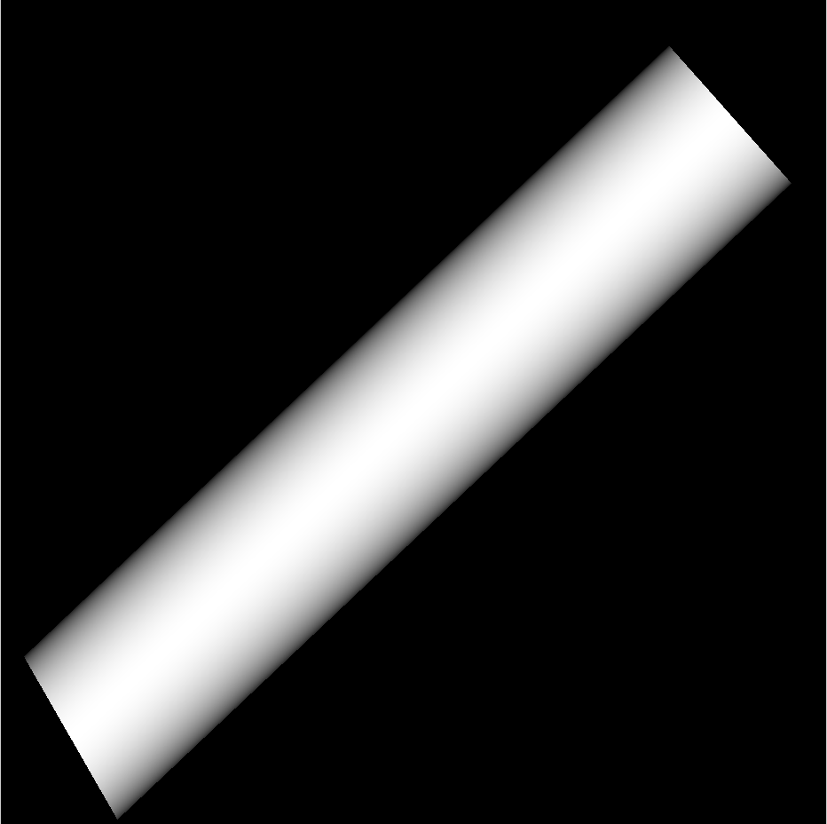
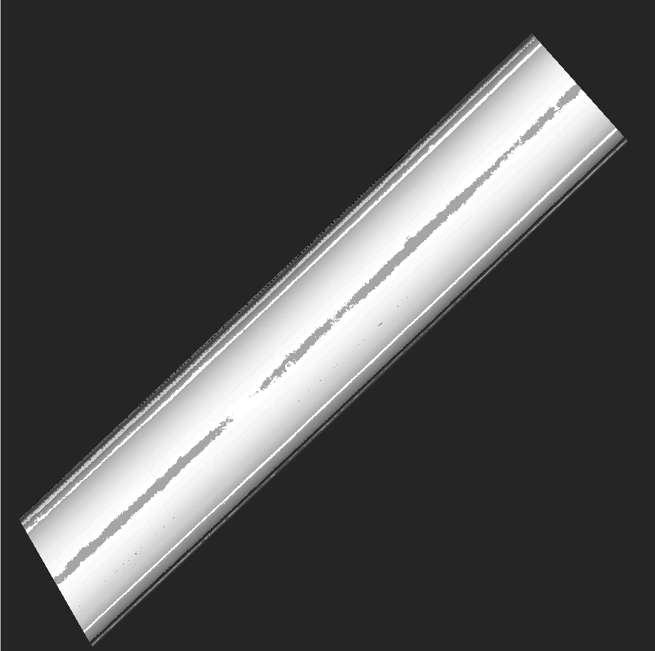

# Jamin-Lebedeff Inversion Code Using Tensorflow
 

## Manuscript 
The manuscript can be found in the [Biorxiv](https://www.biorxiv.org/content/10.1101/765958v1.abstract).

## Step-by-Step 

### JL measurements procedure: 


- Set the light source. We used cooLED pE-4000, preset White2, intensity 5. 
- Align the optical components to achieve proper Köhler illumination and the best interference contrast. 
- The axes of the polarizer and the analyzer has to be perpedicular to each other, with polarizer on 0° and analyzer on 90°.
- Focus the sample with aperture and field diaphragm open.
- Close the field diaphragm and align the condenser to see a single focused image of the field aperture in the centre onf the FOV. 
- Open the aperture to fill the FOV. 
- Change the tilt of the condenser’s beamsplitter, the interference colour change. 
- Change the tilt to turn the background black. 
- Use smartphone – OpenCamera for image acquisiton, with the following settings
- Resolution 3968x2976, focus infinity, ISO 50, white balance and scene mode auto (sadly), exposure 1/40s (or other, just use the same for all measurements), save raw image in .dng format. 
- Video: Resolution 1920x1080, focus infinity, ISO 50, exposure 1/40s. 

The measurements were done according to the following procedure. First, the light sourced was fixed to a reproducible white light equivalent (cooLED pE-4000, preset White2 – wavelenghts 385, 470, 550 and 660 nm, intensity 5). Starting with the polarizer and the analyzer axes at 0° and 90° respectively, which is important in order to see a contrast interference image, the sample is brought roughly into focus. Next, the condenser is aligned to produce a single focused image of the closed field aperture in the sample plane. That way the proper mutual position of the calcite plate of the condenser and the one of the objective is achieved. Then, with the field aperture opened to fill the field of view, adjust the focus and the tilt of the beamsplitter to see a colorful image of the sample in a black background. For image acqusition we used the OpenCamera app on Huawei P9 smartphone with the following settings: focus - infinity, ISO 50, exposure 1/40s (or other, but always using the same for all measurements). 


### MATLAB 

All files can be found in the folder [MATLAB](./MATLAB).

The first thing in order to recover the refractive index (RI) using Jamin Lebedeff measurements is to have a known phase object. A cylindrical object with known phase makes this quiet easy since the sample is easy to model and the same value for RI exists for multiple pixels (i.e. RGB values.). The first step is therefore to create a "data-pair" which has the RGB image from the camera as input and the modeled RI-distribution as output. We provide a ***MATLAB***-script which guides you through the process to produce this datapair necessary for the recovery to work. 

#### 1st Step: Load the image and create the RI model
We provide a file called ```Listings_1_Calibrate_RI_sample_v0.m```which reads in an image and creates the RI distribution. It relies on the freely available MATLAB-toolbox "dipimage" available for download [here](http://www.diplib.org/). Everything was tested with MATLAB V 2018B. 

Parameters to set are the following:

```
%% Add some parameters here
is_dust_particle_remove = false; % do you want to remove dust particles in the ref. image?
is_regularization = false; % eventually regularize the input image (blur it)
is_splinefit = false; % seperate the color channels - only possible with fitting toolbox
n_opdsteps = 50;

% add the library
addpath('./src')

% determine the path for the images 
imfolder = './data/EXP1/'
f_ref_img = 'IMG_20191118_155446.jpg'
f_sample_im = 'IMG_20191118_160025.jpg';    

```


The file for the fiber (in the range of less than **3*lambda** has to be oriented this way: 

<p align="center">

</p>


#### 2nd Step: Select the ROI for the calibration file

If the image is very large it is useful to select a sub-set of the entire FOV. This is conveniently done by a selection using the mouse. The command-line will ask for the following: 
```Please select the center of the ROI you want to process, then click on the outer rim of the ROI.```

The image will look like something like this here:

<p align="center">

</p>


#### 3rd Step: Select the coordinates of the the fiber

To determine the position and orientation of the fiber one has to select 4 points using the ```dipgetcoordinate``` command. The command prompt will guide you through the process by the following command: 

```
Please select 4 coordinates which describe the position of the fiberOrder: Upper-Left Corner, Upper-Right Corner, Lower-Right Corner, Lower-Left Corner 
Thank you :-)Displayed in figure 4
```

Once done, the Fiber gets masked and the RI with a known OPD-max (optical path difference) gets assigned like so:

***1.) Full Fiber:***

<p align="center">

</p>


***2.) Masked Fiber:***

<p align="center">

</p>

***3.) Masked Fiber with ideal RI distribution from prior knowledge:***

<p align="center">

</p>

#### 4th Step: Matlab tries to recover the RI 

Based on the datapair and the resulting Look-up-table (LUT) stored in variables ```R,G,B``` Matlab tries to recover the RI of the previously read fiber (without any regularization!). The result looks like that: 

<p align="center">

</p>

The edges result from ambiguities of nearby colours. 

#### 6th Step: Export for Python code

To have a regularized inversion of the RI distrubtion we rely on **Tensorflow** running in Matlab. Therfore we export the LUT as a **HDF5** file like so: 

```
R_mat = double(R); G_mat = double(G); B_mat = double(B); OPD_mat = double(OPDaxis); I_ref_mat = double(I_ref);   OPDMap_mat = double(OPDMap); mask_mat = double(mask);
save('JL_tensorflow.mat', 'R_mat', 'G_mat', 'B_mat', 'OPD_mat', 'I_ref_mat', 'OPDMap_mat', 'mask_mat' , '-v7.3')
```

The file ```JL_tensorflow.mat```wil be read from Python. IT's important to have a calibration matrix with the same experimental setup as the later measurements (e.g. don'T change intensity of the illumination, vary lambda plates, etc.). 


### PYTHON

All files can be found in the folder [MATLAB](./MATLAB).

The following packages have to be installed:

* numpy
* tensorflow
* matplotlib
* h5py
* nanoimagingtoolkit (https://test.pypi.org/project/NanoImagingPack/, **pip install -i https://test.pypi.org/simple/ NanoImagingPack**


This code is reconstructing the optical path difference (OPD) from RGB images acquired with a cellphone camera. This is done by providing an RGB-calibration measurement with known OPD (e.g. an optical fiber). Currently this OPD-map is computed in MATLAB and preloaded as a .mat file. The idea is to minimize the L2 distance between a measured RGB-pixel and the previously generated OPD/RGB-lookup table. In order to minimize the effect of phase discontuinites, we add TV regularization and use standard Gradient-Descent to minimize a combined loss-function: ```min -> OPD ||(R(OPD)-R_meas)^2 +  (G(OPD)-G_meas)^2 +  (B(OPD)-B_meas)^2 +|| + TV(OPD)```.


A quickstart is given by the file ```Listings_9_formanuscript_Fig3``` which produces the images for the manuscript in Biorxiv. 

#### 1st Step: Input parameters


##### Determine input data:
Provide the algorithm with the previously created matfile for the calibration data (same experimental conditions!):

```
mydatafolder = './data/EXP0/'
mymatfile = mydatafolder+'JL_tensorflow.mat' # Exported MAT-file, contains OPD/R/G/B-Maps
myimagefile = mydatafolder+'2019-03-22 17.35.42.jpg' 
```

##### Determine parameters for ROI size and additional variables:

Some control parameters: 
```
myroisize = 1024 # a subregion of the image will be cropped around the center in order to reduce the computational time
use_mask = False # do you want to use a mas for restricting the recovery?
```

Parameters to fit the (noisy) LUT coming from matlab with a parametric poly-curve:

```
n_poly = 11 # order of polynomial fitted to the data
opdmax = 1650 # maximum optical path-difference in [nm]
use_matlab = False # USe values stored in matlab .MAT?
```

Parameters for the least-squares fitting routine: 

```
lambda_tv = 60 # TV-parameter
epsC = 1e-9 # TV-parameter
lr = 100 # learning-rate
Niter = 200 # number of iteration
is_debug = False # Show results while iterating? 
Ndisplay_text = 10
Ndisplay = 20
```


### CAD

All 3D-printing files to adapt the cellphone, filters etc. to the Zeiss Confocal microscope for the JL measurements can be found in the folder [STL](./STL).


## License

Everything is licensed under GPL v3. 